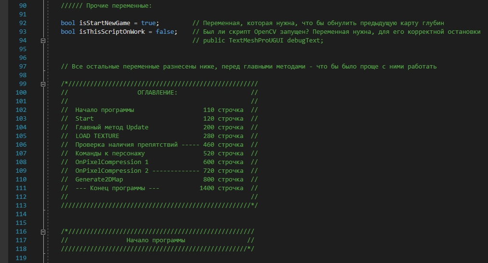

Здесь я собрал некоторые скрипты из моих проектов на Unity

Хоть и кажется, что создавать игры должно быть просто - это не так  
Некоторые скрипты становятся большими и сложными, как в написании, так и в работе  
Но когда всё хорошо отлажено и игровая логика работает как надо, душа радуется, что всё это было не зря 💫  

Например, вот кусочек кода файла **Screen_Shots_01**:

В Дипломном проекте:

* **Colliding_06** отвечал за повороты персонажа по глобальной карте  
* **Screen_Shots_01** - за создание карты глубины, её сжатие и обработку - логику уклонения от ближайших препятствий. В этот скрипт вошло много моих самописных алгоритмов обработки, которые я написал сам  
* **TargetMarkControl** также выполнял ориентирование по глобальной карте  

Узнать больше о дипломном проекте можно в этом репозитории: https://github.com/GogikOrtey/DiplomProject2024

В игре Light Cannon:

* **ShootLaser** создавал луч из пушки игрока, управлял его нкалоном, положением, а также углом отражения от зеркала, и созданием рекурсивных отражений. В магазине материалов Unity не нашлось ничего похожего на то, что я хотел сделать, и по этому мне пришлось создавать весь обработчик событий управления лучом самостоятельно  
* **ShootLaserOnEmitters** то же управление лучом, только для излучателей света, а не для пушки персонажа  
* **Wire_Creating_01** создавал висящие провода, зафиксированные в ключевых точках. на самом деле они состояли из множества маленьких цилиндров, но вместе выглядели цельно и красиво  

К сожеланию, у меня ещё нет места, где бы я описал все свои успехи по созданию этой игры, так что пока что узнать про неё больше не получится
